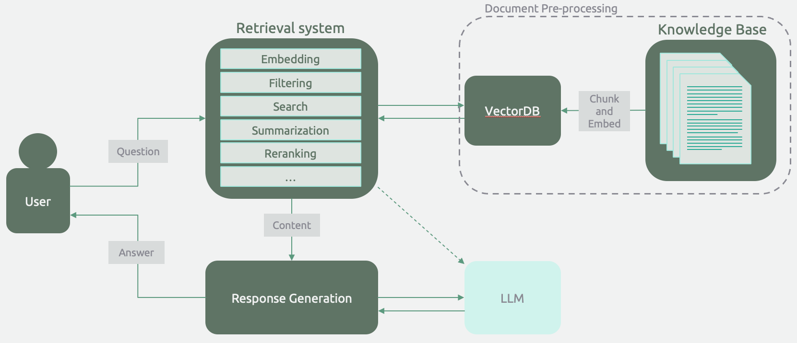
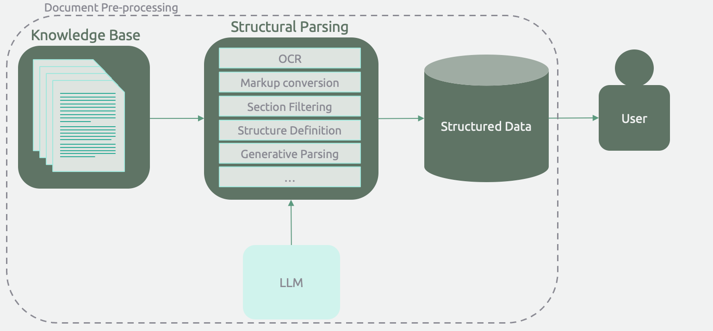
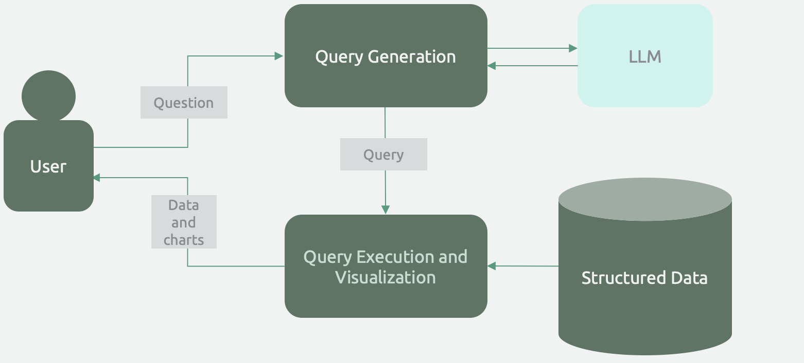
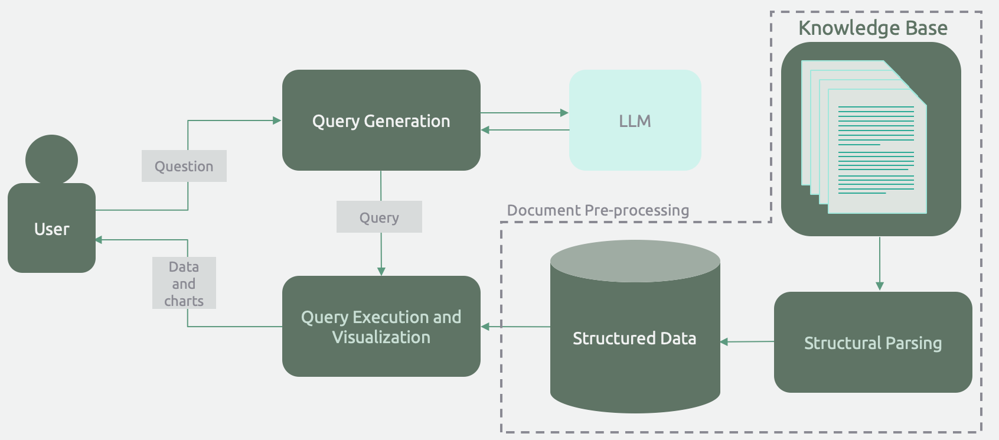
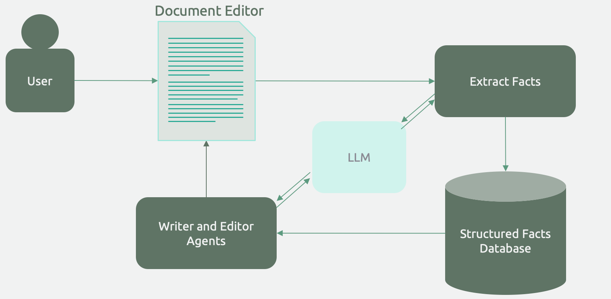

---
date:
  created: 2024-06-12
---
# 5 Archetypes of Knowledge-Intensive Applications
### It doesn't always have to be RAG.

The current GenAI boom has seen the rise of the Retrieval Augmented Generation (RAG) architecture, which promises to enhance the functionality of chatbots by providing them with context from a knowledge base. In some circles, RAG has become synonymous with LLM-based applications. 

I think this is a mistake, and I've believe that many of the most valueable use cases that leverage LLM technology will do so without anything that resembles RAG. 

    <!-- more -->

In the last year, I've advised several innovative companies on their GenAI strategy, and I've implemented applications of this technology for use cases across industries. A subset of GenAI use cases deal with knowledge bases and other large bodies of content. With a nod to the [legendary book](https://www.amazon.com/Designing-Data-Intensive-Applications-Reliable-Maintainable/dp/1449373321) by Martin Kleppmann, I call these **knowledge-intensive applications**. 

I want to provide a set of alternatives to the RAG Chatbot that product and technology leaders can reach to when conceptualizing knowledge-intensive applications. In this article, I'll describe when a RAG chatbot is useful and lay out four other application archetypes that are often more appropriate for a given use case.

## Archetype 1: The RAG Chatbot

The idea, familiar to many practitioners, is to answer user questions by using retrieved knowledge from a knowledge base. Variations and enhancements to RAG, such as reranking, temporal (or other) filtering, and content evaluation fall under this archetype.

The distinguishing feature is using a language model at the _end_ of a set of operations (e.g., filtering, retrieval, summarization) to provide a user response in natural language.

### When is it useful?

I only reach for the RAG Chatbot archetype when the interface needs to be a chatbot. Examples include a sales/customer service agent or a therapist bot. The conversational interface is crucial, and the augmented knowledge enhances effectiveness.

### The Problem with RAG

When I implemented my first RAG application, I was impressed with the concept. It seems unstoppable - if an LLM has all the context relevant for a user's query, it can synthesize that knowledge to provide useful information. As a developer, I tested the proof-of-concept application I had developed by searching for some interesting fact in the content and formulating it as a question. Voilá! The content was retrieved and the LLM dutifully regurgitated as an answer. 

The problem came when I tested questions that real users were interested in. These questions required synthesis, aggregation, calculation, multi-hop reasoning. With enough tweaking and "agentic" application logic, I could get the system to effectively answer some of these classes of questions. But there seemed to be an infinite set of question classes. 

At the end of the day, real users aren't interested in "control-F on steroids", and business execs aren't interested in a productivity tool for their analysts and operators. What everyone really wants is scalable intelligence that unlocks use cases that wouldn't be possible without it. 

## Archetype 2: Structured Generation

For many use cases, unstructured content is more useful when it's structured. If I have ten thousand PDFs with a similar structure, I can't do much analysis. What I want is an Excel table with ten thousand rows.

Structured Generation applications leverage an LLM to perform a basic task at scale. Business leaders know what these tasks would be - the same thing they would do if they had a roman legion of interns! They would create a well-defined task that requires basic (albeit limited) intelligence, repeat it all summer storing the result in a digestible format, and then hand it over experienced analysts leverage this new competitive dataset as they saw fit. 

The distinguishing feature for this application archetype is applying an LLM for element-wise structural generation over a corpus of documents. This operation can incur a significant upfront cost but eliminates the need for LLM calls during user analysis of the resulting structured data.

### When is it useful?

Data is valuable when it's usable. Many end users simply prefer structured datasets for hands-on analysis rather than interacting through a conversational interface. For instance, in private equity deal sourcing, a well-structured Excel spreadsheet is preferred to almost any format short of a deal memo.

The same goes for generated datasets used by other software systems. An example here is literature mining for protein sequence-to-behavior mappings in chemical research. Protein engineering tools can use an augmented database of mined data much better than they can use a chatbot!

To identify use cases, a good place to start is by identifying tasks that require some degree of intelligence, such that an LLM can perform the task, but not basic NLP or data mining. Basic literacy in the interpretation of financial statements is a good example. 

### Upfront costs

Structured Generation will differ from RAG Chatbots in terms of the cost structure as well. Whereas RAG chatbots have very low upfront costs, both in terms of development time to POC and LLM calls, structured generation applications can require significant costs. Compute alone could cost several thousands of dollars if the document corpus is large. These costs will be split between basic document OCR and conversion and LLM calls. Structured generation applications also tend to require more initial development in order to create a processing pipeline and define the optimal structure, but tools like [LlamaParse](https://docs.llamaindex.ai/en/stable/llama_cloud/llama_parse/?gad_source=1&gclid=CjwKCAjwjqWzBhAqEiwAQmtgT1JOzqVSYqoib6N5x9bTz5JguDW1eslZs8LhrBFUsWaYfCOuxKvVxRoCeKkQAvD_BwE) and [Instructor](https://python.useinstructor.com/) help streamline it significantly. 

## Archetype 3: The Generative Query Engine

Sometimes, the owner of a data system might want to provide a natural language interface for querying, analyzing, and visualizing the data. In this case, the user asks a question, the LLM generates a query in the query language of the data system, and the data is either provided back to the user or visualized in a chart.

This architecture leverages the interpolative nature of LLMs. With some minor fine-tuning and few-shot prompting (i.e., providing example queries in the prompt), an LLM can effectively interpret the specification of a query language and generalize its knowledge to the entire range of possible queries. In other words, LLMs are naturally suited to be query generators. 

### When is it useful? 

Many data systems, like the Bloomberg terminal, have a bifurcated userbase. They have a few power users who can write complex queries and generate high-quality charts, and a large number of casual users who use only basic functionality. A natural language interface lets casual users get more value from the product without extensive training. 

For internal business intelligence dashboards, a natural language query engine puts the tool in the hands of executives, who actually use the insights, rather than having them rely on a layer of business analysts who serve as intermediaries. 

## Archetype 4: Structured Generation with Generative Query Engine

By combining archetypes 2 and 3, we can achieve natural language intelligence on a large set of documents. The documents are first processed for structure (archetype 2) and stored in an appropriate database. Then a query engine generates and runs queries and visualizations based on user input.

On the surface, this archetype looks like RAG! A user asks questions and the system responds with insights based on content from a corpus of documents. However, this architecture is much more effective for many business use cases that require a degree of analysis, aggregation or calculation. More concretely, unless the answer is explicitly stated in the document content, a RAG-based application will not be able to answer quantitative (e.g., "how many") questions. 

### When is it useful? 

As with archetype 1, it's important to question the value of providing a chat interface. If users are better served by having access to the data in structured form, archetype 2 might be a better solution. 

If the structured generation stores data in a database that the target user is not comfortable querying, it would be beneficial to provide a query engine. This could be a simple CSV or tables in an SQL database.

!!! Note 
    In theory, although I've never done so myself, the structured generation could produce data in such a complex format that it wouldn't be practical for any human to query, like a complex graph database schema. I suspect that in the coming years, highly intelligent and reliable agents will handle knowledge by developing their own schema that is only practical for intelligent language models to query.

## Archetype 5: Document Editor Co-Pilot

A lot of technical writing is a slog of translating immense amounts of knowledge into a templated structure and ensuring its consistency throughout iterations and project advancements. Writing skills and technical knowledge being in short supply, these writers tend to be among the most valuable members of our society, and we force them to spend their time writing these documents - cancer researchers writing clinical trial protocols (100-150 pages), government officials writing an environmental impact statement (500-1000+ pages), and yes, even open source library developers writing documentation. 

!!! Danger
    I haven't had the chance to develop a document editor co-pilot, so my architectural desciption is speculative

As I imagine it, the architecture will include a generated knowledge base of facts, a (possibly configurable) template for the document structure, and a set of writer/editor agents that work alongside authors to write and refine the document. 

### When is it useful? 

Productivity tools for technical writers _are_ valuable, but only when they leave the writer in the driver's seat. Technical writers don't want auto-complete of the paragraph they are writing. They want an intelligent assistant to fill in parts of the template and help maintain consistency. For example, when the writer updates a set of assumptions or facts in one part of the document, the assistant should propose a set of changes to the rest of the document. 

## Conclusion

It's not always a chatbot, and it's not always RAG. One of my favorite things about working with business leaders in this space is the moment after I've laid out this set of alternatives archetypes and the flood gates open for AI product ideas, coming from every part of the organization.
