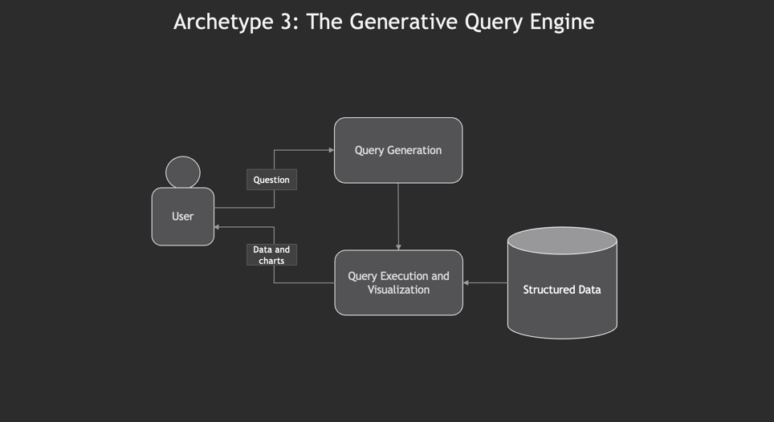

---
date:
  created: 2024-06-04
---
# 5 Archetypes of Knowledge-Intensive Applications
## It's not always RAG
In the last year, I've advised several innovative companies on their GenAI strategy and implemented applications of this technology across industries. A subset of GenAI use cases deal with knowledge bases and other large bodies of content. I call these knowledge-intensive applications, with a nod to the legendary book by Martin Kleppmann.
<!-- more -->

This article aims to provide a set of alternatives to an application pattern that product and technology leaders might reach to too often. I'm referring, of course, to the RAG Chatbot. The revolutionary ChatGPT interface has conditioned us into fixating on a single application type: the chatbot, often enhanced with retrieval-augmented generation (RAG). In this article, I'll describe when a RAG chatbot is useful and lay out four other application archetypes that are often more appropriate for a given use case.

## Archetype 1: The RAG Chatbot

The idea, familiar to many practitioners, is to answer user questions by using retrieved knowledge from a knowledge base. Variations and enhancements to RAG fall under this archetype.

The distinguishing feature is using a language model at the end of a set of operations (e.g., filtering, retrieval, summarization) to provide a user response in natural language.

### When is it useful?

I only reach for the RAG Chatbot archetype when the interface needs to be a chatbot. Examples include a sales/customer service agent or a therapist bot. The conversational interface is crucial, and the augmented knowledge enhances effectiveness.

## Archetype 2: Structured Generation

For many use cases, unstructured content is more useful when it's structured. If I have ten thousand PDFs with a similar structure, I can't do much analysis. What I want is a table with ten thousand rows.

The distinguishing feature here is applying an LLM for element-wise structural generation over a corpus of documents. This operation can incur a significant upfront cost but eliminates the need for LLM calls during user analysis of the resulting structured data.

### When is it useful?

Data is valuable when it's usable. Many end users simply prefer structured datasets for hands-on analysis rather than interacting through a conversational interface. For instance, in private equity deal sourcing, a well-structured Excel spreadsheet is preferred to almost any format short of a deal memo.

The same goes for generated datasets used by other software systems. An example here is literature mining for protein sequence-to-behavior mappings in chemical research.

## Archetype 3: The Generative Query Engine

Sometimes, the owner of a data system might want to provide a natural language interface for querying, analyzing, and visualizing the data. In this case, the user asks a question, the LLM generates a query in the query language of the data system, and the data is either provided back to the user or visualized in a chart.

### When is this useful? 

Many data systems, like the Bloomberg terminal, have many casual users who use only basic functionality and a few power users who can perform complex queries and generate high-quality charts. A natural language interface lets casual users get more value from the product without extensive training.

## Archetype 4: Structured Generation with Generative Query Engine

By combining archetypes 2 and 3, we can achieve natural language intelligence on a large set of documents. The documents are first processed for structure (archetype 2) and stored in an appropriate database. Then a query engine generates and runs queries and visualizations based on user input.

### When is this useful? 

If the structured generation stores data in a database that the target user is not comfortable querying, it would be beneficial to provide a query engine. This could be a simple CSV or tables in an SQL database.

> [!Note] In theory, although I've never done so myself, the structured generation could produce data in such a complex format that it wouldn't be practical for any human to query, like a complex graph database schema. I suspect that in the coming years, highly intelligent and reliable agents will handle knowledge by developing their own schema that is only practical for intelligent language models to query.

## Archetype 5: Document Editor Co-Pilot

The output of some very high-value business processes is a set of documents, hundreds of pages long. Document editor co-pilots will help these highly paid specialists translate immense amounts of research into a template and streamline the process of revisions between co-authors and staff.

The architecture will include a generated knowledge base of facts, a (possibly configurable) template for the document structure, and a set of writer/editor agents that work alongside authors to write and refine the document. 

### When is this useful? 

The top minds in many industries, such as pharmaceutical research, spend months producing formal documents for regulatory approval. Revisions to one part of the document might require combing through hundreds of pages to ensure consistency. Proper tooling here could cut the time to a first draft dramatically and improve interfaces for collaboration and iteration between authors and regulators.

## Conclusion

It's not always a chatbot, and it's not always RAG. I've found that once tech leaders are presented with more compelling application design patterns in GenAI, they start uncovering use cases that are much more valuable. 

